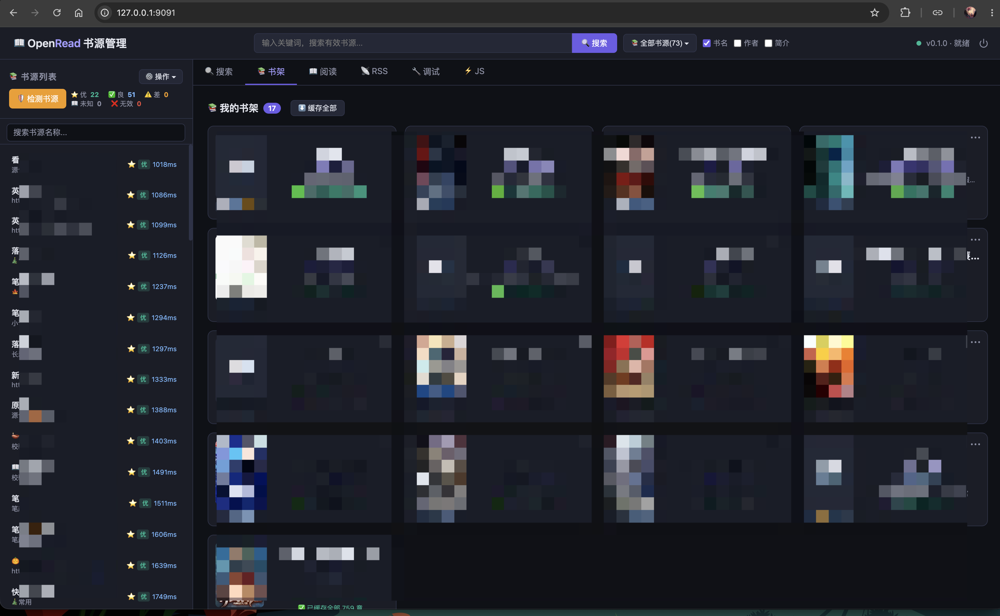
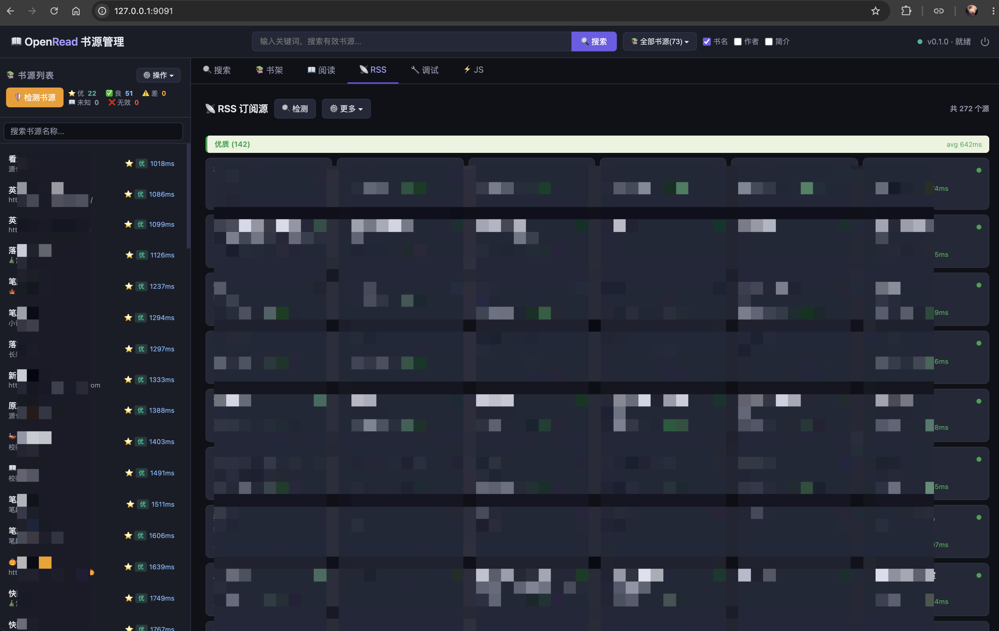

# AriaRead

[依赖更新完整指南](docs/dependencies.md) — 版本固定、选择性更新、离线、回退与提交步骤。

当前版本 **0.2.2** · Aria **3.1.1**

📖 跨平台阅读引擎，专注于开源中文书源生态。

基于 [Aria](https://github.com/dqsjqian/Aria)（C++23 响应式 MVVM 框架）构建，兼容主流书源格式。

[English](README.en.md) | [简体中文](README.md)

## 界面截图

同一份 C++ 核心同时驱动两种 Web 形态：

| 形态 | 截图 | 说明 |
|---|---|---|
| REST + SSE 薄客户端 |  | 浏览器直连 C++ HTTP 壳，Property 变化经 SSE 推送 |
| SSR 服务端渲染 |  | 页面由 C++ 侧渲染，前端零 JS 依赖也能跑 |

## 特性

- **C++23 响应式 MVVM**：基于 Aria 框架，支持协程异步、响应式状态与 ViewModel
- **跨平台引擎**：CSS3/XPath 选择器、JS 运行时桥接、Gumbo HTML5 解析
- **按平台精简依赖**：锁定源码与校验缓存；Windows 使用系统 Schannel，不构建 OpenSSL；macOS 使用系统钥匙串验证证书
- **扩展 ViewModel 层**：SearchViewModel、BookshelfViewModel、ReaderViewModel、SourceViewModel
- **Engine Adapters**：engine_reader_adapter、engine_source_adapter，将 engine.h 的私有依赖隔离在 .cpp 内
- **C++ Web Server**：Mira（自研 C++23 协程网络库）+ Aria ViewModel，39 条 REST 路由，SSE 推送，零 Python 依赖

## 构建

当前稳定工具链基线（2026-10-02）：GCC **16.2.0**、LLVM Clang **23.1.2**、Xcode **27.0** / AppleClang **21.0**、Visual Studio 2026 stable / MSVC Build Tools **14.51.36247**。统一 C++23；配置时拒绝旧编译器，CI 不保留旧版兼容任务。

需要 CMake 3.21+、支持 C++23 的编译器、Git 和 Python 3.10+。统一入口负责取依赖、配置、并行编译和打包：

```bash
# macOS / Linux
python3 tools/build.py

# Windows：普通 PowerShell 即可，自动查找 Visual Studio C++ x64 工具链
python tools/build.py

# Windows：明确选择已经安装的 MSYS2 UCRT64 / MinGW 工具链
python tools/build.py --toolchain mingw

# 开发验收：补齐测试依赖，构建并运行全部测试
python3 tools/build.py --test
```

Windows 默认只需 Visual Studio C++ 工具链、Windows SDK、CMake、Git、Python；**不要求安装 MSYS2、Perl 或 OpenSSL**。两套编译器是可选方案，无须同时安装。MSVC/MinGW 的构建目录与依赖前缀分开，下载缓存共享。默认 TLS 后端是 Schannel；需对比旧后端时传 `--tls-backend openssl`，届时才需要 Perl 和相应 make 工具。

macOS 使用 Xcode Command Line Tools；OpenSSL 构建仍需系统 Perl/make。curl 通过 Apple SecTrust 使用系统钥匙串，不依赖 Homebrew 的 CA 文件。Linux 还需要 Perl/make 和系统 CA 证书。运行 Web 回归需要 Node.js 18+。

默认只构建运行时，跳过 doctest；`--test` 补齐测试。普通重跑复用已验证依赖，`--offline` 使用精确锁定的本地源码缓存，`--jobs N` 限制并行数。`--build-dir` / `ARIAREAD_BUILD_DIR` 自定义构建目录，`--deps-prefix` / `ARIAREAD_DEPS_PREFIX` 自定义依赖前缀。

## 运行与分发

| 入口 | 默认运行目录 |
|---|---|
| macOS / Linux | `build/bin/` |
| Windows MSVC | `build/windows-msvc-release/bin/`（多配置生成器为 `bin/Release/`） |
| Windows MinGW | `build/windows-mingw-release/bin/` |

完成后入口打印实际可执行文件路径。运行目录包含服务程序、Aria 动态库、`web/` 和 `licenses/`，可以整体复制；开发时可用 `--web-root bindings/web/ariaread/web` 指定源码资源。

原 `bash scripts/build_web_release.sh`、`scripts/build_web_release.ps1` 保留为统一入口的兼容包装。Windows 只支持 Release，提前拒绝不匹配的 Debug CRT；空 CMake build type 自动选择 Release。`--clean` 仅清理当前应用构建，不删除下载缓存或依赖前缀。

## 项目结构

```
AriaRead/
├── CMakeLists.txt          # C++23，全平台统一编译选项
├── include/                # 公共头文件
│   └── ariaread/
│       └── version.h.in    # 版本号模板
├── src/                    # 核心引擎源码
│   ├── engine/             # 引擎核心
│   ├── selector/           # CSS/XPath 选择器
│   ├── rule/               # 规则解析器
│   ├── infra/              # 基础设施（HTTP/JS/DB）
│   ├── viewmodels/         # ViewModel 层
│   └── apps/web_server/    # Web Server（Mira HTTP/1.1 + REST API）
├── tools/build.py          # 跨平台统一构建入口
├── tools/ci/
│   ├── build_ariaread_deps.py  # 第三方依赖唯一来源：版本锁 + SHA256（见下）
│   └── fetch_aria.py           # Aria 依赖文件指定的完整提交取回脚本 -> build/deps/aria
├── bindings/web/ariaread/web/  # 前端静态资源
└── tests/                  # 单元测试
```

## 依赖：一条路，不由 CMake 联网

所有第三方库（Mira / OpenSSL / libcurl / zlib / nlohmann_json / SQLite3 /
QuickJS / Gumbo / doctest / sqlite_modern_cpp）统一保存在 `dependencies.json`：
来源字段与可选 `version` 表示要求，自动生成的 `resolved` 记录实际版本、不可变提交和归档 SHA256。首次解析选最新稳定版，
后续普通构建复用锁；显式版本优先。归档校验、编译产物和许可证只写进 `build/deps/`。CMake 只做 `find_package`，
配置时不联网、没有 vendored 回退分支。Aria（兄弟框架）同理：由
`tools/ci/fetch_aria.py` 以依赖文件指定的完整提交取到 `build/deps/aria`，无 submodule。
脚本每次检查实际 Git HEAD 和工作树，拒绝覆盖本地修改；更新成功后将旧目录保留为
`build/deps/aria-backup-*`。尚未发布的同一提交可用
`python3 tools/ci/fetch_aria.py --source /path/to/Aria`（或 `ARIA_SOURCE` 环境变量）取回。
本地联调也可在 CMake 配置时显式指定 `-DARIA_DIR=/path/to/Aria`。

```bash
python3 tools/ci/build_ariaread_deps.py            # 开发 SDK（含测试）；Windows 默认不构建 OpenSSL
python3 tools/ci/fetch_aria.py                     # 取回 Aria（依赖文件指定的完整提交，无 submodule）
cmake -S . -B build -DARIAREAD_BUILD_TESTS=ON -DCMAKE_BUILD_TYPE=Release      # 自动探测 build/deps/prefix
cmake --build build
ctest --test-dir build --output-on-failure
```

自定义安装位置用脚本 `--prefix <prefix>`，再传 `-DARIAREAD_DEPS_PREFIX=<prefix>` 给 CMake。

```bash
python3 tools/ci/build_ariaread_deps.py --update                 # 主动更新最新稳定版并重建
python3 tools/ci/build_ariaread_deps.py --version zlib=1.3.2      # 显式版本优先
python3 tools/ci/build_ariaread_deps.py --offline                # 精确锁定的离线缓存
python3 tools/ci/build_ariaread_deps.py --only zlib,json          # 部分依赖及所需前置依赖
```

安装缓存绑定依赖文件、构建配方/补丁、编译器、Release 配置和每个安装文件的内容。
按组件记录来源、配方、补丁及安装文件归属。局部更新只重建变更组件及受影响的静态消费者；
编译器/ABI 变化才重建整个前缀。旧格式缓存首次迁移需重建一次，随后复用；
更新保留 `prefix-backup-*`，失败时恢复旧前缀，
保留 `prefix-failed-*` 供排查。已安装文件或 Git 缓存有本地修改时拒绝覆盖。
`--offline` 不发现新版本；离线重建需要依赖文件中的归档/Git 提交已缓存。
`--profile runtime` 不需要 doctest；默认 `tests` 包含它。`--only` 局部安装仍需补齐选定 profile，才通过 CMake 的离线校验。
QuickJS、Gumbo、sqlite_modern_cpp 的本地补丁仅应用到已审核版本；上游新版本需要先适配配方，
脚本会明确报错，避免旧补丁静默套到新源码。Windows 支持 MSVC 和 MinGW；只有显式选择 OpenSSL 后端才需要 nmake/make。

详见 [依赖精简与 Mira 分工](docs/build-architecture.md)。CI 缓存锁定源码与安装前缀，不缓存庞大的编译中间目录；恢复后仍逐文件验证。

## 测试

从仓库根目录配置、构建并运行测试：

```bash
cmake -S . -B build -DARIAREAD_BUILD_TESTS=ON -DCMAKE_BUILD_TYPE=Release
cmake --build build
ctest --test-dir build --output-on-failure
```

默认使用 Release；Windows 配置阶段会拒绝不受支持的配置，避免链接时才出现 CRT 失配。推荐 `python3 tools/build.py --test`，同时管理测试依赖和 CMake 选项。

CTest 会注册引擎、可用的 ViewModel 测试和本地依赖获取安全回归，并在找到 Node.js 18+、Python 3.10+ 与 Web Server 目标时注册相应的调试回归。缺少可选依赖时，CMake 会明确提示跳过；可用 `-DARIAREAD_BUILD_WEB_TESTS=OFF` 关闭 Web 回归。

```bash
# 仅运行调试回归
ctest --test-dir build -R ariaread-debug --output-on-failure

# 也可独立运行；无需安装 npm 或 pip 包
node tests/test_debug_ui.cjs
python3 tests/test_debug_http.py --server build/bin/ariaread_web_server
```

HTTP 测试只使用本地模拟书源和内存数据库，覆盖控制台输入校验与运行限制、SSE 成功及失败阶段、响应和 gzip 解压大小限制、端口占用保护。服务路径也可通过 `ARIAREAD_WEB_SERVER` 环境变量指定；使用其他构建目录或多配置生成器时，将路径改为对应的可执行文件。

## 开源准备

- [x] 源码全部从源码编译（无预编译二进制）
- [x] 无 git submodule；第三方依赖和 Aria 均由脚本锁定并获取
- [x] MIT LICENSE
- [x] README.md（中文）+ README.en.md（英文）

## 许可证

MIT License — 详见 [LICENSE](LICENSE)。

自有代码采用 MIT；第三方组件保留各自协议。分发说明见 [第三方许可声明](THIRD_PARTY_NOTICES.md)。
